CampusLink is a **desktop app for managing contacts, optimized for use via a Command Line Interface** (CLI) while still having the benefits of a Graphical User Interface (GUI). If you can type fast, CampusLink can get your contact management tasks done faster than traditional GUI apps.

* Table of Contents
{:toc}

--------------------------------------------------------------------------------------------------------------------

## Quick start

1. Ensure you have Java `17` or above installed in your Computer.<br>
   **Mac users:** Ensure you have the precise JDK version prescribed [here](https://se-education.org/guides/tutorials/javaInstallationMac.html).
   **Windows users** Ensure you have the precise JDK version prescribed [here](https://se-education.org/guides/tutorials/javaInstallationWindows.html).
   **Linux users** Ensure you have the precise JDK version prescribed [here](https://se-education.org/guides/tutorials/javaInstallationLinux.html).

1. Download the latest `.jar` file from [here](https://github.com/AY2526S2-CS2103T-F12-2/tp/releases).

1. Copy the file to the folder you want to use as the _home folder_ for CampusLink.

1. Open a command terminal, `cd` into the folder you put the jar file in, and use the `java -jar addressbook.jar` command to run the application.<br>
   A GUI similar to the below should appear in a few seconds. Note how the app contains some sample data.<br>
   

1. Type the command in the command box and press Enter to execute it. e.g. typing **`help`** and pressing Enter will open the help window.<br>
   Some example commands you can try:

   * `list` : Lists all contacts.

   * `add n/John Doe p/98765432 e/johnd@example.com a/John street, block 123, #01-01` : Adds a contact named `John Doe` to the Address Book.

   * `delete 3` : Deletes the 3rd contact shown in the current list.

   * `edit 2 g/student` : Edits the group information of the 2nd contact in the current list.

   * `clear` : Deletes all contacts.

   * `pic 1` : Opens a file picker to set a profile picture for the 1st contact.

   * `followup 1 f/Send project files` : Sets a follow-up reminder on the 1st contact.

   * `clearfollowup 1` : Removes the follow-up reminder from the 1st contact.

   * `toggle color mode` : Switches between dark and light mode.

   * `exit` : Exits the app.

1. Refer to the [Features](#features) below for details of each command.

--------------------------------------------------------------------------------------------------------------------

## Features

<div markdown="block" class="alert alert-info">

**:information_source: Notes about the command format:**<br>

* Words in `UPPER_CASE` are the parameters to be supplied by the user.<br>
  e.g. in `add n/NAME`, `NAME` is a parameter which can be used as `add n/John Doe`.

* Items in square brackets are optional.<br>
  e.g `n/NAME [t/TAG]` can be used as `n/John Doe t/friend` or as `n/John Doe`.

* Items with `…`​ after them can be used multiple times including zero times.<br>
  e.g. `[t/TAG]…​` can be used as ` ` (i.e. 0 times), `t/friend`, `t/friend t/family` etc.

* Parameters can be in any order.<br>
  e.g. if the command specifies `n/NAME p/PHONE_NUMBER`, `p/PHONE_NUMBER n/NAME` is also acceptable.

* Extraneous parameters for commands that do not take in parameters (such as `help`, `list`, `exit` and `clear`) will be ignored.<br>
  e.g. if the command specifies `help 123`, it will be interpreted as `help`.

* For commands that parse prefixed fields (e.g. `find`), prefixes unrelated to that command are treated as normal text input instead of parsed fields.<br>
  e.g. in `find`, `f/` is treated as text unless it appears under a supported `find` prefix such as `n/` or `a/`.

* If you are using a PDF version of this document, be careful when copying and pasting commands that span multiple lines as space characters surrounding line-breaks may be omitted when copied over to the application.
</div>

### Using command autocomplete

As you type in the command box, CampusLink suggests matching commands in a dropdown.

* The popup appears while you are typing the **command word** (before the first space).
* Each suggestion shows the command name and a short summary of its parameters, e.g. `sort - CONDITION ORDER (e.g. firstname a)`.
* Use `↓` / `↑` to move between suggestions. Press `Enter` to apply the highlighted suggestion — this fills the command field with a template you can edit.
* Press `Esc` to dismiss the popup without applying anything.
* After the template is inserted, replace the placeholder values with your input and press `Enter` to execute the command.

<div markdown="span" class="alert alert-primary">:bulb: **Tip:**
For commands with no arguments (e.g. `list`, `clear`, `exit`), pressing `Enter` on the suggestion executes the command immediately without a second press.
</div>

--------------------------------------------------------------------------------------------------------------------

### Viewing help : `help`

**Opens a link to the full CampusLink User Guide in your browser.**

If you are unsure what commands are available or how to use a specific feature, `help` displays a pop-up window with a URL to this guide. Click the **Copy URL** button and paste it into your browser to read the full documentation.

Format: `help`


**What happens:** A help window appears with a link to this User Guide. No changes are made to your contacts.

--------------------------------------------------------------------------------------------------------------------

### Adding a person : `add`

**Saves a new contact to CampusLink.**

Use this command when you meet someone new — a classmate, professor, or project teammate — and want to store their details for later. You must provide their name, phone number, email, and address. Everything else (tags, group, position, major, available hours) is optional and can be added now or edited later.

Format: `add n/NAME p/PHONE_NUMBER e/EMAIL a/ADDRESS [t/TAG]… [g/GROUP]… [po/POSITION]… [m/MAJOR]… [h/AVAILABLE_HOURS]`

**Arguments:**

| Argument | Prefix | Required | Description |
|---|---|---|---|
| Name | `n/` | ✅ Yes | Full name of the contact |
| Phone number | `p/` | ✅ Yes | Contact's phone number |
| Email | `e/` | ✅ Yes | Contact's email address |
| Address | `a/` | ✅ Yes | Contact's address |
| Tag | `t/` | No | A short label (e.g. `friend`, `TA`). Add as many as you like. |
| Group | `g/` | No | A class or project group (e.g. `CS2103T`). Add as many as you like. |
| Position | `po/` | No | Their role or title (e.g. `Professor`, `Peer`). Add as many as you like. |
| Major | `m/` | No | Their course of study (e.g. `Computer Science`). Add as many as you like. |
| Available hours | `h/` | No | When they are typically free (e.g. `Mon 2-4pm`). |

<div markdown="span" class="alert alert-primary">:bulb: **Tip:**
A person can have any number of tags, groups, majors, and positions (including 0). You can always add or change these later using the `edit` command.
</div>

<div markdown="span" class="alert alert-warning">:exclamation: **Duplicate Detection:**
CampusLink automatically detects duplicate contacts. A contact is considered a duplicate if it shares the same **name**, **phone number**, or **email** as an existing contact. If a duplicate is detected, the contact will **not** be added and a warning will indicate which fields are duplicated (e.g. `duplicate name, phone detected`).
</div>

**Examples:**

* Adding a classmate with just the required details:
  ```
  add n/John Doe p/98765432 e/johnd@example.com a/John street, block 123, #01-01
  ```
  *Outcome: John Doe is added to the contact list with his phone, email, and address.*

* Adding a contact with optional fields (major and tags):
  ```
  add n/Betsy Crowe t/friend e/betsycrowe@example.com a/Newgate Prison p/1234567 t/criminal m/Law
  ```
  *Outcome: Betsy Crowe is added with two tags (`friend`, `criminal`) and her major set to `Law`.*

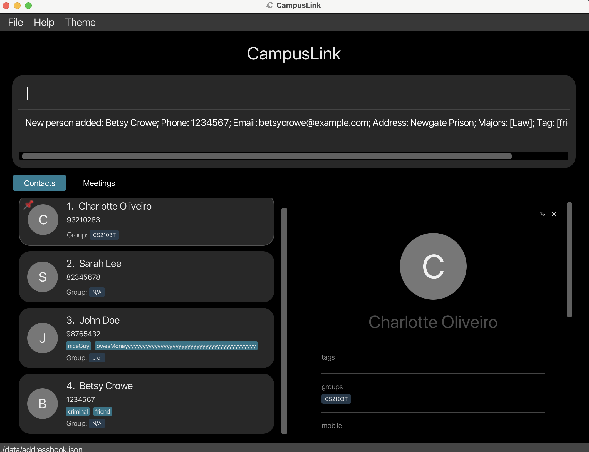

--------------------------------------------------------------------------------------------------------------------

### Listing all contacts : `list`

**Shows every contact saved in CampusLink.**

Use this after a `find` or `sort` command to return to the full unfiltered view of all your contacts.

Format: `list`

**What happens:** The contact panel refreshes to display all saved contacts in their current sort order. No contacts are added, removed, or modified.

--------------------------------------------------------------------------------------------------------------------

### Editing a contact : `edit`

**Updates one or more details of an existing contact.**

Use this when a classmate changes their phone number, you want to add a new tag, or you need to fix a typo in someone's name. You identify the contact by their position number in the currently displayed list, then specify only the fields you want to change.

Format: `edit [FLAG] INDEX [n/NAME] [p/PHONE] [e/EMAIL] [a/ADDRESS] [t/TAG]… [g/GROUP]… [po/POSITION]… [m/MAJOR]… [h/AVAILABLE_HOURS]`

**Arguments:**

| Argument | Description |
|---|---|
| `FLAG` | Optional. Use `-a` to **append** new values to existing ones (e.g. add a tag without removing existing tags). Use `-r` to **replace** all existing values with the new ones. If omitted, fields like name and phone are overwritten, and multi-value fields (tags, groups, etc.) are replaced. |
| `INDEX` | The number shown next to the contact in the list. Must be a positive whole number (1, 2, 3, …). |
| `n/NAME` | New name for the contact. |
| `p/PHONE` | New phone number. |
| `e/EMAIL` | New email address. |
| `a/ADDRESS` | New address. |
| `t/TAG` | Tag to set. Use `t/` with nothing after it to remove all tags. |
| `g/GROUP` | Group to set. Use `g/` with nothing after it to remove all groups. |
| `po/POSITION` | Position to set. |
| `m/MAJOR` | Major to set. |
| `h/AVAILABLE_HOURS` | Available hours to set. |

<div markdown="span" class="alert alert-info">:information_source: **Note:**
At least one field (besides the flag) must be provided. You cannot run `edit 1` with nothing else — there would be nothing to change.
</div>

**Examples:**

* Update the phone number and email of the 1st contact:
  ```
  edit 1 p/91234567 e/johndoe@example.com
  ```
  *Outcome: The 1st contact's phone becomes `91234567` and email becomes `johndoe@example.com`. All other details remain unchanged.*

* Add a tag to the 2nd contact without removing their existing tags:
  ```
  edit -a 2 t/visible
  ```
  *Outcome: The tag `visible` is added to the 2nd contact's existing tags.*

* Remove all tags from the 3rd contact:
  ```
  edit 3 t/
  ```
  *Outcome: All tags are cleared from the 3rd contact.*
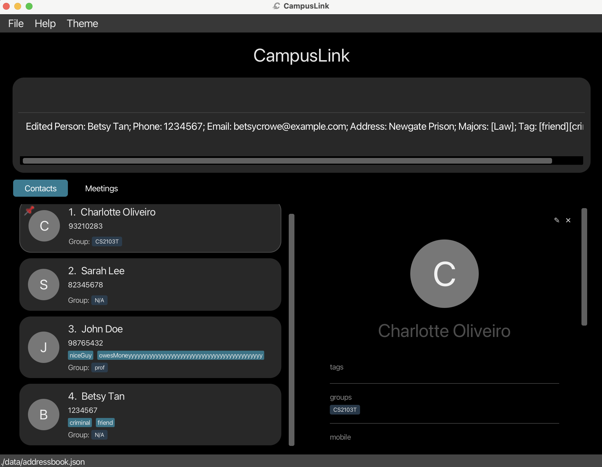

--------------------------------------------------------------------------------------------------------------------

### Finding contacts : `find`

**Searches your contact list and shows only matching results.**

Use this when you want to quickly locate a specific person or a group of people. You can search across multiple fields at once and control whether multiple keywords for the same field must **all** match or whether **any one** of them is enough.

Format: `find [[FLAG] PREFIX/KEYWORD]…`

| Argument | Description |
|---|---|
| `PREFIX/KEYWORD` | What to search for. Use `n/` for name, `p/` for phone, `e/` for email, `a/` for address, `g/` for group, `po/` for position, `m/` for major, `t/` for tag, `h/` for available hours. |
| `-c` (flag) | **Compulsory / all-match** — ALL keywords under `-c` must match their respective fields. |
| `-o` (flag) | **Optional / any-match** — ANY one keyword under `-o` matching its field is sufficient. |

**Arguments:**
* At least one keyword must be supplied, each preceded by its prefix (e.g., `n/`).
* Flags control matching behavior for the keywords that follow them. By default (no flag) keywords are treated as `-o` (any-match).
* Flags must be surrounded by spaces (but flag at the very end of a command does not require trailing space). Where input can be read as both a flag and a keyword, it is treated as a flag.
* When multiple flags appear, each keyword follows the last flag before it. E.g., `-c -o n/James -c po/Principal` → optional name "James", compulsory position "Principal".

**How matching works:**
* This section introduces exact match rule, but in general typo is permitted, as explained in the **Fuzzy Search** section below.
* Search is case-insensitive — `hans` matches `Hans`.
* For names, only full words match — `H` does **not** match `Hans`.
* Keywords for other fields (email, phone, etc.) are partial matches.
* For name, email, address and phone, compulsory find requires the whole keyword to match, while optional find only requires any space separated part of a keyword to match.
* When both compulsory and optional fields are given, a contact must satisfy **all** compulsory conditions **and at least one** optional condition to appear in the results.
* If only optional fields are given, a contact must satisfy at least one of them to appear in the results; if only compulsory fields are given, a contact must satisfy all of them to appear in the results.
* Flags are **space-delimited** — a token is treated as a flag only if it appears after a space, and is followed by a space.
* Repeated flags with no meaningful content between them are allowed. Blank space and intermediate chunks without any prefixes are ignored by later parsing.
* A valid flag marks the end of the previous flagged segment. Once a valid flag appears, subsequent text is interpreted under the new flag.
* Search input is intentionally permissive. The parser does not restrict what kind of value may be entered under each prefix. For example, searching for phone number `xyz` is permitted.
* Under `-c`: **all** keywords for the same field must match (AND semantics). e.g. `-c n/John n/Doe` only returns contacts whose name matches both `John` **and** `Doe`.
* Under `-o`: **any** keyword for the same field matching is enough (OR semantics). e.g. `-o n/Alex n/David` returns contacts whose name contains `Alex` **or** `David`.

**Fuzzy Search** (name `n/`, phone `p/`, address `a/`, email `e/` fields only):

*Details and behavior:*
* Fuzzy matching allows up to **2 edits** (insert, delete, substitute).
* Matching is token-based: both the field value and keyword are split by spaces first.
* For a multi-word keyword (e.g. `Alex Yeaa`), each keyword part must fuzzy-match at least one token in the field.
* For name keyword (`n/`), only full-word fuzzy matches are considered. For other fields, substring matches are allowed (e.g. `p/123` matches `91234567`).
* For `a/`, `p/`, `e/`, exact case-insensitive substring matches are also accepted, then fuzzy match is applied if exact match fails.
* Fields `t/`, `m/`, `po/`, `g/`, `h/` do not use fuzzy matching.
* Result order after filtering keeps pinned contacts first, then sorts by fuzzy score (the proximity between the field and search keywords).

**Examples:**

* Find everyone named John:
  ```
  find n/John
  ```
  *Outcome: Shows all contacts whose name contains "John" (e.g. `John Doe`, `John Smith`).*

* Find contacts with a typo in name (fuzzy search):
  ```
  find n/Alxe
  ```
  *Outcome: Still matches contacts like `Alex Yeoh` because `Alxe` is within the fuzzy match threshold.*

* Find contacts named Alex **or** David (any-match, default):
  ```
  find n/Alex n/David
  ```
  *Outcome: Shows `Alex Yeoh`, `David Li`, and anyone else named Alex or David.*
  

* Find contacts named both "John" **and** "Doe" (all-match):
  ```
  find -c n/John n/Doe
  ```
  *Outcome: Shows only contacts whose name contains both `John` and `Doe`, e.g. `John Doe`.*

* `find n/Alex Yeaa` returns `Alex Yeoh` (2 edits: `Yeaa` → `Yeoh`)

* Find contacts in the CS2103T group, with the optional tag `project` or `friend`, but with typos in between:
  ```
  find -c g/CS2103T -o t/project t/friend -c -otypo
  ```
  *Outcome: Shows contacts who are in the `CS2103T` group **and** have at least one of `project` or `friend` tag.*

--------------------------------------------------------------------------------------------------------------------

### Scheduling a meeting : `meet`

Creates a meeting at a specific time with contacts who satisfy your filters and are available in that time slot.

Format: `meet DESCRIPTION h/START-END [d/YYYY-MM-DD] [n/NAME] [g/GROUP] [m/MAJOR] [po/POSITION] [t/TAG]…`

* `DESCRIPTION` is required and must come first as plain text (without a prefix).
* `h/START-END` is required and must appear exactly once.
* `d/YYYY-MM-DD` is optional and must appear at most once. If omitted, today's date is used.
* `n/`, `g/`, `m/`, `po/`, and `t/` are optional filters. If you provide multiple filters, a contact is included if they match **at least one** provided filter.
* Prefixes not listed above (for example `a/`) are treated as plain description text instead of attendee filters.
* If no filters are provided, all contacts are checked for availability.
* Time format must be valid (e.g., `0900-1000`). Date format must be valid (e.g., `2026-04-01`).
* Empty keywords are not allowed (e.g., `n/` is invalid).
* If a contact has no available hours set, they are treated as available by default.
* The command fails if no available contacts match the filters.
* The command also fails if an identical meeting already exists.

Examples:
* `meet Project sync h/1200-1300 d/2026-04-01 n/Alex g/CS2103T m/Computer Science po/TA t/project`
* `meet Daily standup h/0900-1000`

--------------------------------------------------------------------------------------------------------------------

### Deleting a contact : `delete`

**Permanently removes a contact from CampusLink.**

Use this when someone is no longer relevant to your studies — for example, a contact from a module you have completed. The contact is identified by their position number in the currently displayed list.

Format: `delete INDEX`

**Arguments:**

| Argument | Description |
|---|---|
| `INDEX` | The number shown next to the contact in the list. Must be a positive whole number (1, 2, 3, …). |

* If the deleted contact appears in any meeting attendees list, they are removed from those meetings automatically.
* If a meeting has no attendees left after removal, that meeting is deleted automatically.
* Remaining meetings are reindexed to stay contiguous (1, 2, 3, ...), so there are no blank meeting numbers.
 
<div markdown="span" class="alert alert-warning">:exclamation: **Caution:**
Deletion is permanent. There is no undo. If you are unsure, consider using `find` first to confirm you have the right contact before deleting.
</div>

**Examples:**

* Delete the 2nd contact currently shown:
  ```
  delete 2
  ```
  *Outcome: The 2nd contact in the displayed list is permanently removed.*

* Find a specific person, then delete them:
  ```
  find n/Betsy
  delete 1
  ```
  *Outcome: Searches for "Betsy", then deletes the 1st result (the first contact named Betsy).*
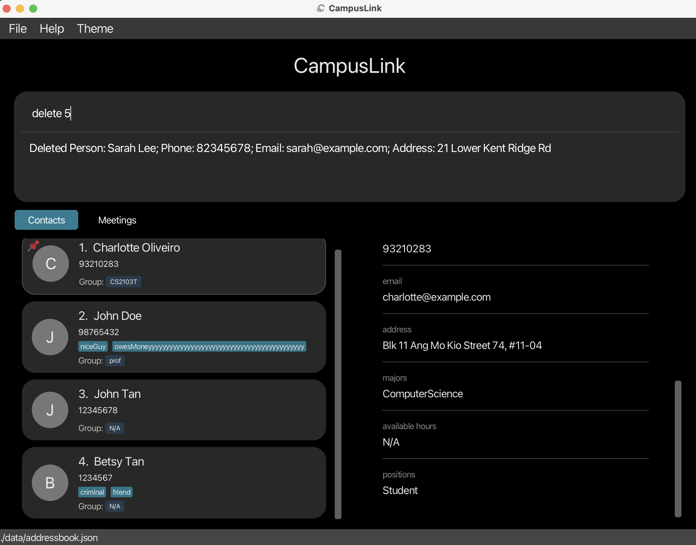

--------------------------------------------------------------------------------------------------------------------

### Pinning a contact : `pin`

**Keeps an important contact permanently at the top of your list.**

Use this to bookmark your most frequently contacted people — professors you are emailing regularly, or project teammates you need to reach quickly. Running the same command again on a pinned contact will unpin them.

Format: `pin INDEX`

**Arguments:**

| Argument | Description |
|---|---|
| `INDEX` | The number shown next to the contact in the list. Must be a positive whole number (1, 2, 3, …). |

* A pinned contact moves to the top of the list and shows a 📌 icon.
* Running `pin INDEX` on an already-pinned contact **unpins** them and returns them to their normal position.
* A maximum of **3** contacts can be pinned at a time. Attempting to pin a 4th will show an error.
* Pin status is saved automatically and persists when you close and reopen the app.

**Examples:**

* Pin the 1st contact:
  ```
  pin 1
  ```
  *Outcome: The 1st contact moves to the top of the list with a 📌 icon.*

* Unpin a previously pinned contact (who is now showing as contact 1 at the top):
  ```
  pin 1
  ```
  *Outcome: The 📌 icon is removed and the contact returns to their normal position in the list.*
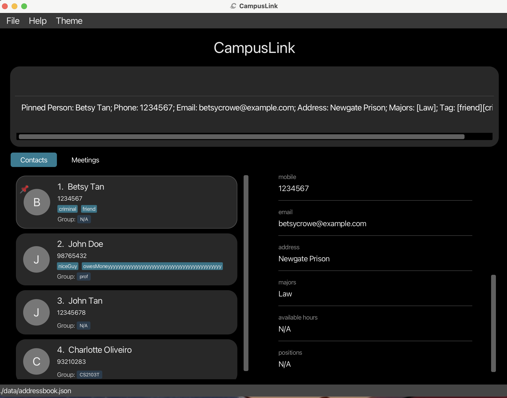

--------------------------------------------------------------------------------------------------------------------

### Sorting contacts : `sort`

**Reorders the contact list by a field of your choice.**

Use this to quickly browse your contacts in alphabetical order, or to surface recently added contacts at the top. Pinned contacts always stay at the very top regardless of sort order, with the sort applied to everyone else below them.

Format: `sort CONDITION ORDER`

**Arguments:**

| Argument | Values | Description |
|---|---|---|
| `CONDITION` | `firstname` | Sorts by the **first word** of each contact's name (e.g. "Alice" in "Alice Tan"). |
| | `lastname` | Sorts by the **last word** of each contact's name (e.g. "Tan" in "Alice Tan"). |
| | `recent` | Sorts by the order contacts were added or imported — newest first. |
| `ORDER` | `a` or `ASC` | Ascending order (A → Z for names; oldest first for `recent`). |
| | `d` or `DESC` | Descending order (Z → A for names; newest first for `recent`). |

* The sort is case-insensitive.
* Sorting is a **display preference only** — it does not modify the saved data and resets when you restart the app.

**Examples:**

* Sort everyone alphabetically by first name (A to Z):
  ```
  sort firstname a
  ```
  *Outcome: The list reorders so contacts starting with A appear first, Z last.*

* Sort by last name in reverse order (Z to A):
  ```
  sort lastname DESC
  ```
  *Outcome: Contacts with surnames starting with Z appear first.*

* Restore the list to the order contacts were originally added:
  ```
  sort recent a
  ```
  *Outcome: The most recently added or imported contacts appear at the top.*


--------------------------------------------------------------------------------------------------------------------

### Setting a profile picture : `pic`

**Attaches a photo to a contact so you can recognise them at a glance.**

Use this to add a face to a name — useful when your contact list grows large or when you want to quickly identify someone on campus. Running the command opens a file picker where you can choose an image from your computer.

Format: `pic INDEX`

**Arguments:**

| Argument | Description |
|---|---|
| `INDEX` | The number shown next to the contact in the list. Must be a positive whole number (1, 2, 3, …). |

* Supported image formats: **PNG, JPG, JPEG, GIF, BMP**.
* If no picture has been set yet, a 📷 button appears on the contact card — clicking it also opens the file picker.
* If a picture already exists, clicking on the image opens the file picker to replace it.
* The picture is saved automatically and will appear every time you reopen the app.

**Examples:**

* Open the file picker for the 1st contact:
  ```
  pic 1
  ```
  *Outcome: A file picker window opens. Select an image file and click Open — the photo will appear on the contact's card.*

* Replace the photo of the 3rd contact:
  ```
  pic 3
  ```
  *Outcome: A file picker opens. Choose a new image to replace the existing one.*

--------------------------------------------------------------------------------------------------------------------

### Toggling dark / light mode : `toggle color mode`

**Switches the app's colour theme between dark mode and light mode.**

Use this to make CampusLink more comfortable to read depending on your environment — dark mode for low-light settings, light mode for bright rooms. You can also click the ☀ / 🌙 button at the top-right corner of the window to do the same thing.

Format: `toggle color mode`

**What happens:** The entire app switches colour theme instantly. Your preference is saved and applied the next time you open CampusLink.
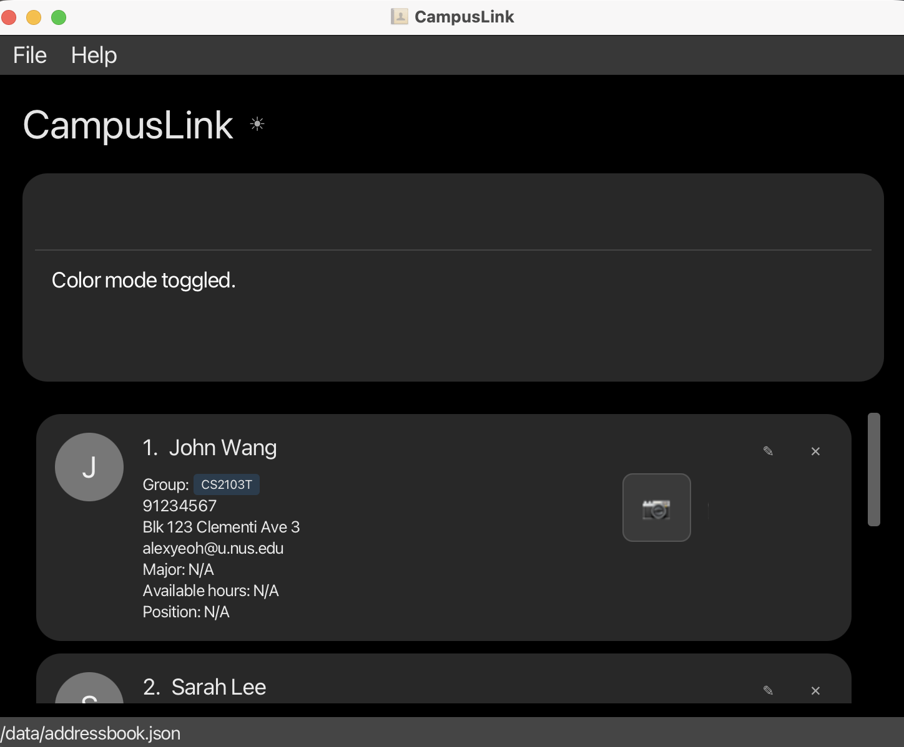
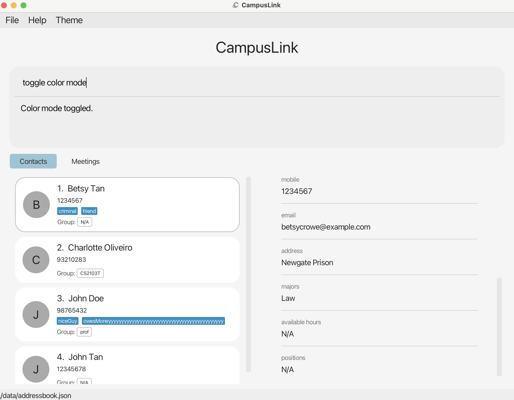

--------------------------------------------------------------------------------------------------------------------

### Clearing all contacts : `clear`

**Deletes every contact in CampusLink at once.**

Use this when you want to start completely fresh — for example, at the beginning of a new semester. This removes all contacts from the app permanently.

Format: `clear`

<div markdown="span" class="alert alert-warning">:exclamation: **Caution:**
This action is permanent and cannot be undone. All contacts will be lost. Consider using `export` to save a backup first if you may need the data later.
</div>

**What happens:** Every contact and every meeting is deleted. Both lists become empty. No data can be recovered after this command.
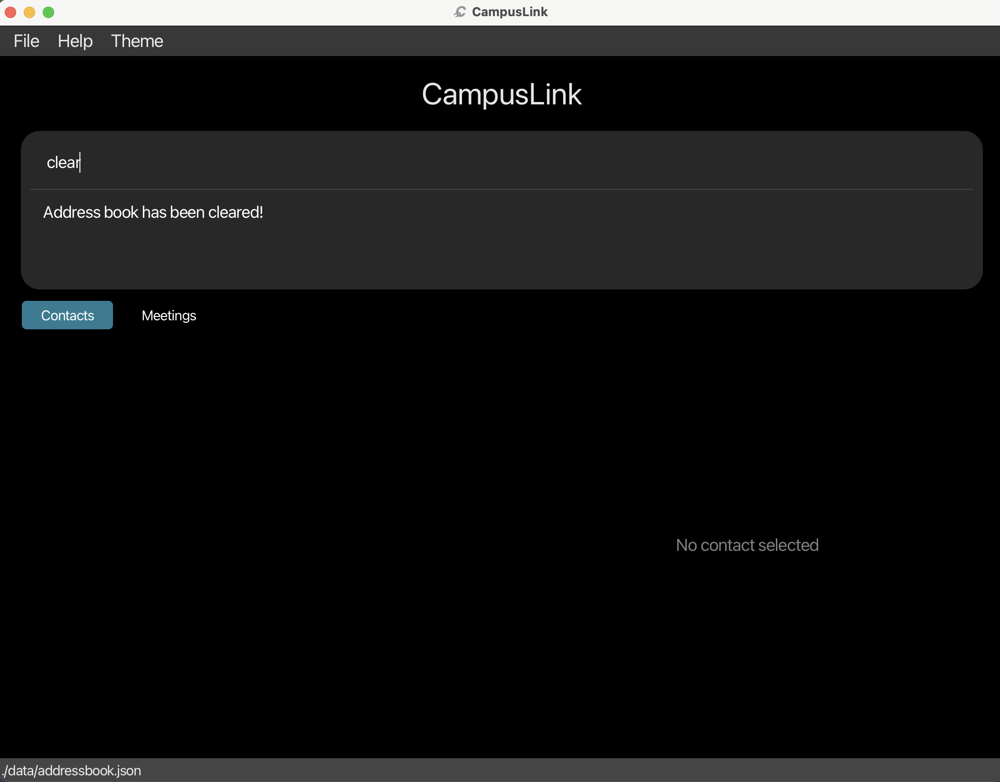

--------------------------------------------------------------------------------------------------------------------

### Setting a password : `setpassword`

**Locks CampusLink behind a password so only you can access your contacts.**

Use this if you store sensitive contact information and want to prevent others from viewing it. Once set, every time you open CampusLink you will be asked to enter the password before the app loads. After 3 incorrect attempts, all contacts are permanently erased as a security measure.

Format: `setpassword pw/PASSWORD`

**Arguments:**

| Argument | Prefix | Description |
|---|---|---|
| Password | `pw/` | The password you want to set. Must not be empty or consist of spaces only. |

* If a password is already set, this command replaces it with the new one.
* The password is stored as a **SHA-256 hash** — your actual password text is never saved anywhere, making it secure.

<div markdown="span" class="alert alert-warning">:exclamation: **Caution:**
If you enter the wrong password **3 times** on startup, **all contacts will be permanently erased** and password protection will be removed. There is no recovery mechanism. Consider noting your password somewhere safe.
</div>

**Examples:**

* Set a password:
  ```
  setpassword pw/mySecret123
  ```
  *Outcome: The next time you open CampusLink, you will be prompted to enter `mySecret123` before the app loads.*
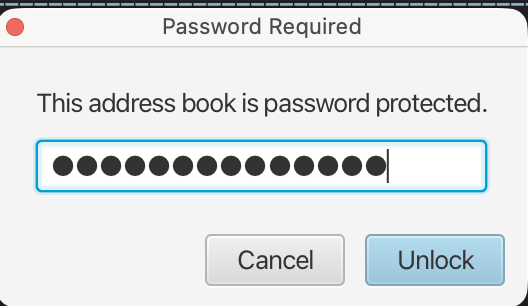
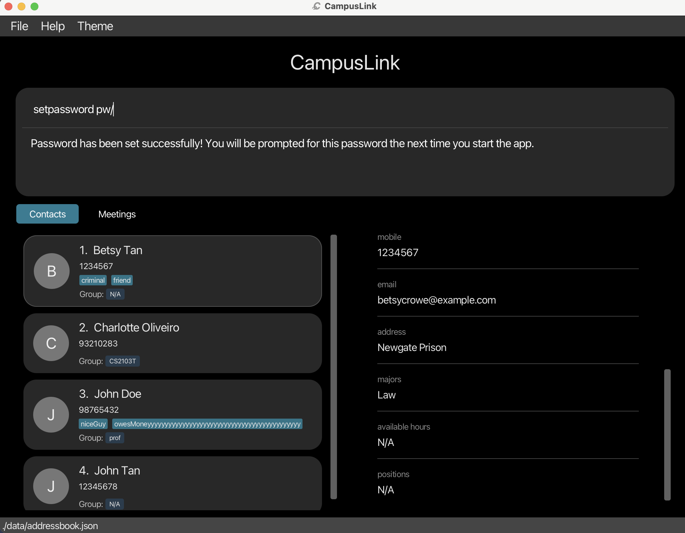

--------------------------------------------------------------------------------------------------------------------

### Removing password protection : `removepassword`

**Disables the password requirement so CampusLink opens without asking for a password.**

Use this if you no longer need to lock the app — for example, if you are the only person using your computer.

Format: `removepassword`

**What happens:** Password protection is turned off. CampusLink will open directly without a password prompt on the next launch.

* If no password is currently set, a message is shown and no changes are made.
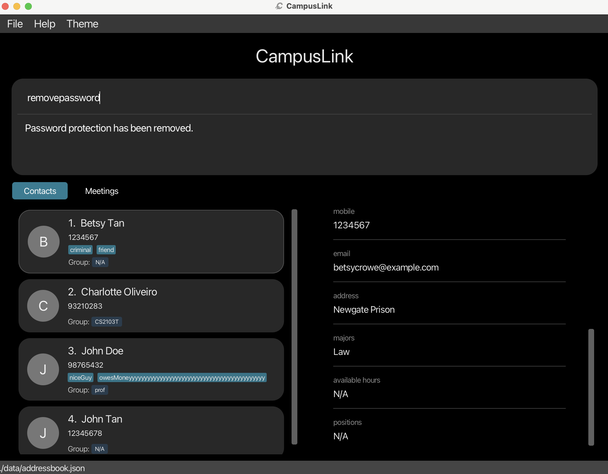

--------------------------------------------------------------------------------------------------------------------

### Exporting contacts : `export`

**Saves all your contacts to a file on your computer.**

Use this to create a backup of your contacts, or to transfer them to another computer. The exported file is saved in JSON format and can be imported back into CampusLink later using the `import` command.

Format: `export fp/FILE_PATH`

**Arguments:**

| Argument | Prefix | Description |
|---|---|---|
| File path | `fp/` | The location and name of the file to save (e.g. `backup.json` or `data/contacts_backup.json`). |

* If the file already exists at that path, it will be **overwritten**.
* The export includes **all** contacts, regardless of any active search filter.

**Examples:**

* Export all contacts to a file called `backup.json` in the same folder as the app:
  ```
  export fp/backup.json
  ```
  *Outcome: A file named `backup.json` is created in the current folder containing all your contacts.*

* Export to a specific folder:
  ```
  export fp/data/team_contacts.json
  ```
  *Outcome: A file named `team_contacts.json` is created inside the `data` folder.*
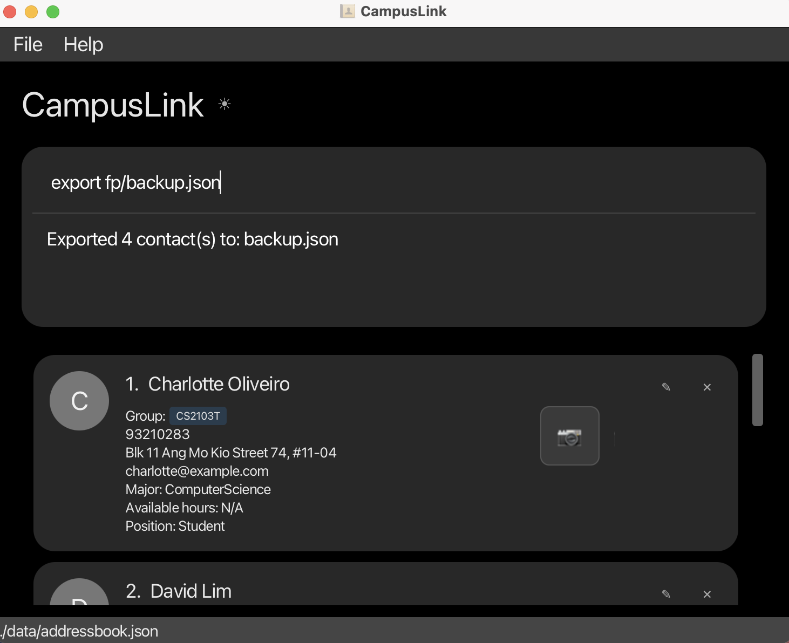

--------------------------------------------------------------------------------------------------------------------

### Importing contacts : `import`

**Loads contacts from a file into CampusLink.**

Use this to restore a backup or to bring in contacts from another computer. The import only adds contacts that do not already exist — your current contacts are never overwritten or removed.

Format: `import fp/FILE_PATH`

**Arguments:**

| Argument | Prefix | Description |
|---|---|---|
| File path | `fp/` | The path to a `.json` file previously exported from CampusLink. |

* The import is **additive** — existing contacts are kept as-is.
* If an imported contact has the same name as an existing contact, it is **skipped** (not added again).
* Newly imported contacts are added to the **top** of the list, preserving their relative order from the file.
* After the command, the result message tells you how many contacts were added and how many were skipped.

<div markdown="span" class="alert alert-primary">:bulb: **Tip:**
Use `export` on one computer and `import` on another to transfer your contacts easily.
</div>

**Examples:**

* Import contacts from a backup file:
  ```
  import fp/backup.json
  ```
  *Outcome: All contacts in `backup.json` that are not already in your list are added. A message shows how many were added and how many were skipped.*

* Import from a specific folder:
  ```
  import fp/data/team_contacts.json
  ```
  *Outcome: Contacts from `team_contacts.json` inside the `data` folder are merged into your contact list.*
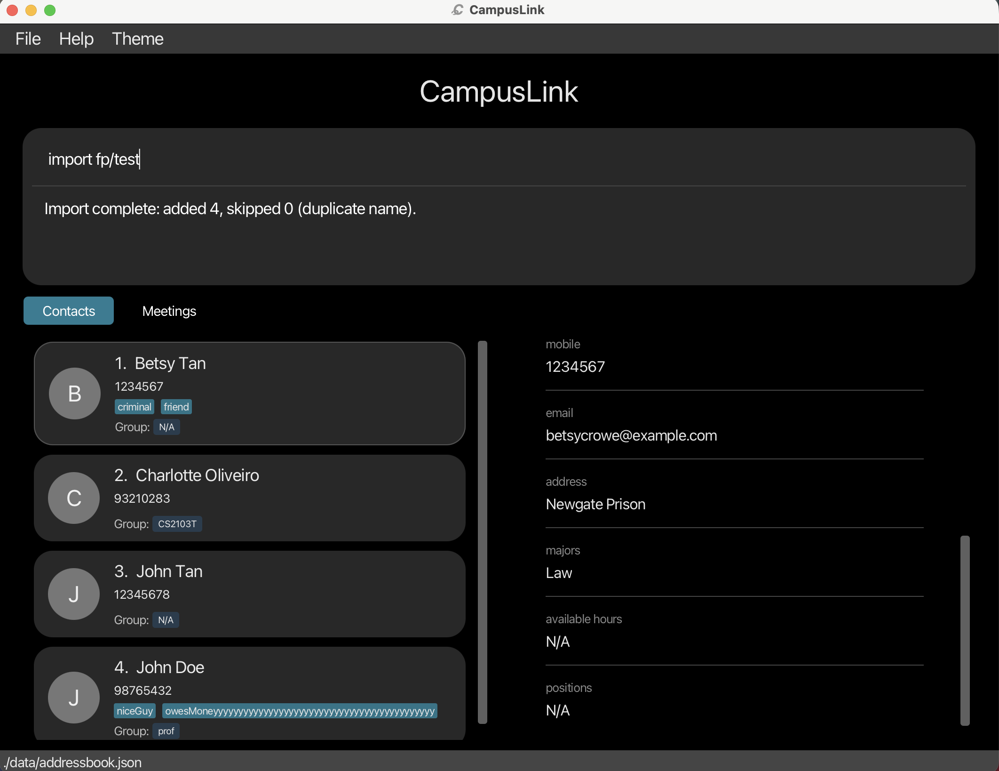

--------------------------------------------------------------------------------------------------------------------

### Setting a follow-up reminder : `followup`

**Attaches a reminder note to a contact so you do not forget to follow up with them.**

Use this when you need to remember to send someone a message, share files, or discuss something later. Every time you open CampusLink, all contacts with active reminders are shown in the result panel so you can see what needs your attention.

Format: `followup INDEX f/NOTE`

**Arguments:**

| Argument | Prefix | Description |
|---|---|---|
| Index | — | The number shown next to the contact in the list. Must be a positive whole number (1, 2, 3, …). |
| Note | `f/` | The reminder message. Must not be blank or start with a space. |

* If a reminder already exists on that contact, it is **replaced** by the new note.
* Reminders are shown automatically in the result display every time the app starts.

**Examples:**

* Add a reminder to the 1st contact:
  ```
  followup 1 f/Email about internship by Friday
  ```
  *Outcome: The reminder "Email about internship by Friday" is attached to the 1st contact. It will appear in the result panel the next time you open the app.*

* Update the reminder on the 3rd contact:
  ```
  followup 3 f/Discuss project deadline next week
  ```
  *Outcome: Any existing reminder on the 3rd contact is replaced with the new note.*
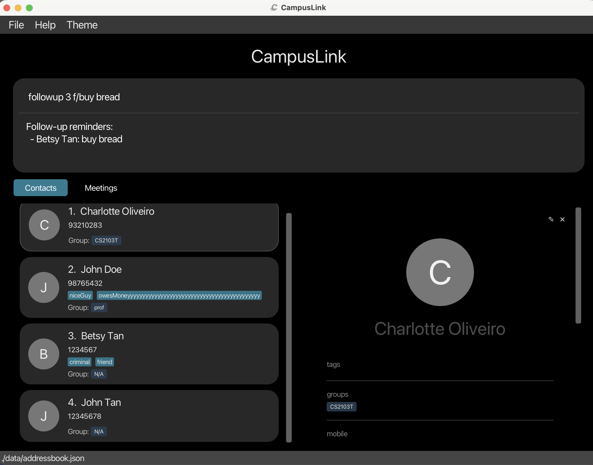
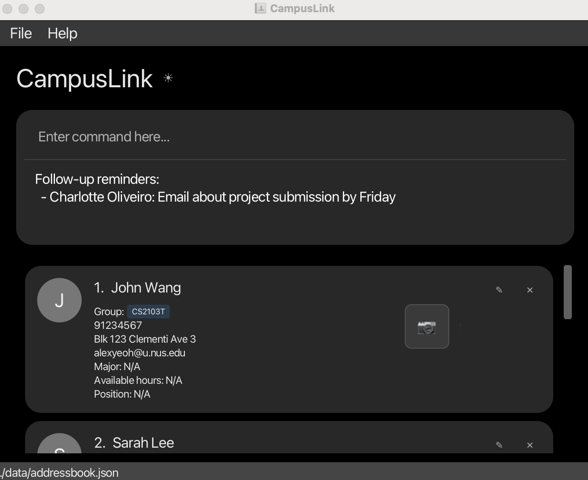

--------------------------------------------------------------------------------------------------------------------

### Clearing a follow-up reminder : `clearfollowup`

**Removes the reminder note from a contact once you have finished the task.**

Use this after you have sent that email, made that call, or completed whatever you needed to follow up on. Clearing the reminder removes it from the startup reminder list.

Format: `clearfollowup INDEX`

**Arguments:**

| Argument | Description |
|---|---|
| `INDEX` | The number shown next to the contact in the list. Must be a positive whole number (1, 2, 3, …). |

* If the contact has no active reminder, an error message is shown and nothing changes.

**Examples:**

* Clear the reminder from the 1st contact:
  ```
  clearfollowup 1
  ```
  *Outcome: The follow-up note is removed from the 1st contact. They will no longer appear in the startup reminder list.*

--------------------------------------------------------------------------------------------------------------------

### Exiting the app : `exit`

**Closes CampusLink.**

All data is already saved automatically, so you do not need to do anything before exiting.

Format: `exit`

**What happens:** The application window closes. All your contacts and settings are preserved for the next time you open CampusLink.

--------------------------------------------------------------------------------------------------------------------

### Saving the data

CampusLink saves your data automatically to the hard disk after every command that makes a change. **There is no need to save manually.**

### Editing the data file

Your contacts are saved as a JSON file at `[JAR file location]/data/addressbook.json`. Advanced users are welcome to edit this file directly.

<div markdown="span" class="alert alert-warning">:exclamation: **Caution:**
If the data file is edited incorrectly and becomes invalid, CampusLink will discard all data and start with an empty contact list on the next run. It is strongly recommended to keep a backup copy of the file before making any direct edits. Editing the file incorrectly may also cause unexpected behavior even if the file appears valid.
</div>

--------------------------------------------------------------------------------------------------------------------

## FAQ

**Q**: How do I transfer my data to another Computer?<br>
**A**: On your current computer, run `export fp/backup.json` to save all contacts to a file. Copy `backup.json` to the other computer, then run `import fp/backup.json` in CampusLink there. Alternatively, you can manually copy the data file at `[JAR file location]/data/addressbook.json` to the same location on the other computer.

--------------------------------------------------------------------------------------------------------------------

## Known issues

1. **Pressing Enter twice for templated commands**: When you type a partial command word (e.g. `sort`) and press `Enter` to accept the autocomplete suggestion, the command field is filled with a template (e.g. `sort firstname a`). Edit the placeholders and press `Enter` **once** to execute. The first `Enter` only applies the template; it does not execute the command.
2. **When using multiple screens**, if you move the application to a secondary screen, and later switch to using only the primary screen, the GUI will open off-screen. The remedy is to delete the `preferences.json` file created by the application before running the application again.
3. **If you minimize the Help Window** and then run the `help` command (or use the `Help` menu, or the keyboard shortcut `F1`) again, the original Help Window will remain minimized, and no new Help Window will appear. The remedy is to manually restore the minimized Help Window.
4. **If you forget your password**, there is currently no password recovery mechanism. You can reset the app by deleting `preferences.json` (removes password) and `data/addressbook.json` (removes all contacts) from the app's home folder.

--------------------------------------------------------------------------------------------------------------------

## Command summary

Action | Format, Examples
--------|------------------
**Add** | `add n/NAME p/PHONE_NUMBER e/EMAIL a/ADDRESS [t/TAG]…​` <br> e.g., `add n/James Ho p/22224444 e/jamesho@example.com a/123, Clementi Rd, 1234665 t/friend t/colleague`
**Clear** | `clear`
**Delete** | `delete INDEX`<br> e.g., `delete 3`
**Edit** | `edit [FLAG] INDEX [n/NAME] [p/PHONE_NUMBER] [e/EMAIL] [a/ADDRESS] [t/TAG]…​`<br> e.g.,`edit -r 2 n/James Lee e/jameslee@example.com`
**Export** | `export fp/FILE_PATH`<br> e.g., `export fp/backup.json`
**Find** | `find [[FLAG] [PREFIX/KEYWORDS]]`<br> e.g., `find n/James Jake`
**Meet** | `meet DESCRIPTION h/START-END [d/YYYY-MM-DD] [n/NAME] [g/GROUP] [m/MAJOR] [po/POSITION] [t/TAG]…`<br> e.g., `meet Project sync h/1200-1300 d/2026-04-01 n/Alex g/CS2103T t/project`
**Follow-up** | `followup INDEX f/NOTE`<br> e.g., `followup 1 f/Email about internship by Friday`
**Clear Follow-up** | `clearfollowup INDEX`<br> e.g., `clearfollowup 1`
**Import** | `import fp/FILE_PATH`<br> e.g., `import fp/backup.json`
**List** | `list`
**Pin** | `pin INDEX`<br> e.g., `pin 1`
**Sort** | `sort CONDITION ORDER`<br> e.g., `sort firstname a`
**Help** | `help`
**Set Password** | `setpassword pw/PASSWORD`<br> e.g., `setpassword pw/mySecret123`
**Remove Password** | `removepassword`
**Profile Picture** | `pic INDEX`<br> e.g., `pic 2`
**Toggle Color Mode** | `toggle color mode`
