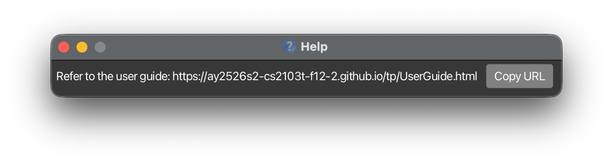

CampusLink is a **desktop app for managing contacts, optimized for use via a Command Line Interface** (CLI) while still having the benefits of a Graphical User Interface (GUI). If you can type fast, CampusLink can get your contact management tasks done faster than traditional GUI apps.

* Table of Contents
{:toc}

--------------------------------------------------------------------------------------------------------------------

## Quick start

1. Ensure you have Java `17` or above installed in your Computer. 
   **Mac users:** Ensure you have the precise JDK version prescribed [here](https://se-education.org/guides/tutorials/javaInstallationMac.html).

1. Download the latest `.jar` file from [here](https://github.com/AY2526S2-CS2103T-F12-2/tp/releases).

1. Copy the file to the folder you want to use as the _home folder_ for CampusLink.

1. Open a command terminal, `cd` into the folder you put the jar file in, and use the `java -jar addressbook.jar` command to run the application. 
   A GUI similar to the below should appear in a few seconds. Note how the app contains some sample data. 
   

1. Type the command in the command box and press Enter to execute it. e.g. typing **`help`** and pressing Enter will open the help window. 
   Some example commands you can try:

   * `list` : Lists all contacts.

   * `add n/John Doe p/98765432 e/johnd@example.com a/John street, block 123, #01-01` : Adds a contact named `John Doe` to the Address Book.

   * `delete 3` : Deletes the 3rd contact shown in the current list.

   * `edit 2 g/student` : Edits the group information of the 2nd contact in the current list.

   * `clear` : Deletes all contacts.

   * `pic 1` : Opens a file picker to set a profile picture for the 1st contact.

   * `toggle color mode` : Switches between dark and light mode.

   * `exit` : Exits the app.

1. Refer to the [Features](#features) below for details of each command.

--------------------------------------------------------------------------------------------------------------------

## Features

**:information_source: Notes about the command format:** 

* Words in `UPPER_CASE` are the parameters to be supplied by the user. 
  e.g. in `add n/NAME`, `NAME` is a parameter which can be used as `add n/John Doe`.

* Items in square brackets are optional. 
  e.g `n/NAME [t/TAG]` can be used as `n/John Doe t/friend` or as `n/John Doe`.

* Items with `…`​ after them can be used multiple times including zero times. 
  e.g. `[t/TAG]…​` can be used as ` ` (i.e. 0 times), `t/friend`, `t/friend t/family` etc.

* Parameters can be in any order. 
  e.g. if the command specifies `n/NAME p/PHONE_NUMBER`, `p/PHONE_NUMBER n/NAME` is also acceptable.

* Extraneous parameters for commands that do not take in parameters (such as `help`, `list`, `exit` and `clear`) will be ignored. 
  e.g. if the command specifies `help 123`, it will be interpreted as `help`.

* If you are using a PDF version of this document, be careful when copying and pasting commands that span multiple lines as space characters surrounding line-breaks may be omitted when copied over to the application.

### Viewing help : `help`

Shows a message explaining how to access the help page.

Format: `help`

### Adding a person: `add`

Adds a person to the address book.

Format: `add n/NAME p/PHONE_NUMBER e/EMAIL a/ADDRESS [t/TAG]… [g/GROUP]… [po/POSITION]… [m/MAJOR]… [h/AVAILABLE_HOURS]​`

:bulb: **Tip:**
A person can have any number of tags, groups, majors and positions (including 0)

:exclamation: **Duplicate Detection:**
CampusLink automatically detects duplicate contacts. A contact is considered a duplicate if it shares the same **name**, **phone number**, or **email** as an existing contact. If a duplicate is detected, the contact will **not** be added and a warning will indicate which fields are duplicated (e.g. `duplicate name, phone detected`).

Examples:
* `add n/John Doe p/98765432 e/johnd@example.com a/John street, block 123, #01-01 m/Biology`
* `add n/Betsy Crowe t/friend e/betsycrowe@example.com a/Newgate Prison p/1234567 t/criminal`

### Listing all persons : `list`

Shows a list of all persons in the address book.

Format: `list`

### Editing a person : `edit`

Edits an existing person in the address book.

Format: `edit [FLAG] INDEX [n/NAME] [p/PHONE] [e/EMAIL] [a/ADDRESS] [t/TAG]…​`

* Edits the person at the specified `INDEX`. The index refers to the index number shown in the displayed person list. The index **must be a positive integer** 1, 2, 3, …​
* If "-a" is used as flag, new fields will be appended to existing ones; if "-r" is used, then existing fields will be overwritten.
* If no flag is given, then by default existing fields will be overwritten.
* For fields where a contact can have at most one (e.g., name, address), "-a" flag will overwrite the existing fields.
* At least one of the optional fields (excluding flag) must be provided.
* You can remove all the person’s tags, groups, etc.,  by typing `t/` without
    specifying any tags after it.

Examples:
*  `edit 1 p/91234567 e/johndoe@example.com` Edits the phone number and email address of the 1st person to be `91234567` and `johndoe@example.com` respectively.
*  `edit -a 2 t/visible` Adds tag "visible" to the 2nd person.

### Locating persons by name: `find`

Finds persons whose names contain any of the given keywords.

Format: `find [[FLAG] [PREFIX/KEYWORDS]]`.

* The search is case-insensitive. e.g `hans` will match `Hans`. Keywords themselves have no restriction, but they must be nonempty when leading and trailing spaces are trimmed (i.e., "n/Al?ce" is allowed but "n/[SPACE]" is not).
* The order of the keywords does not matter. e.g. `n/Hans n/Bo` will match `Bo Hans`
* User supplies at least one of search keywords, all of which should be preceded by corresponding prefix (e.g., n/).
* For names, only full words will be matched e.g. `Han` will not match `Hans`
* User can use flags: "-o" for optional fields, "-c" for compulsory fields. All keywords following a certain flag will be processed according to that flag. By default (no flag) fields are all optional.
* Flags should be preceded and followed by one space each. Where a part of input can be interpreted as both flag and keyword, it will be treated as a flag.
* When more than two flags exist, keywords will be processed according to the last flag before it. E.g., for "-c -o n/James -c po/Principal", parse result will be an optional name "James" and a compulsory position "Principal".
* Persons matching all compulsory fields (if any) AND, when optional keywords exist, at least one optional keyword, will be returned (i.e., for "-c n/James -o po/Principal", find result will contain everyone who is both named "James" and has position "Principal").

Examples:
* `find n/John` returns `john` and `John Doe`
* `find n/alex n/david` returns `Alex Yeoh`, `David Li` 
  

### Deleting a person : `delete`

Deletes the specified person from the address book.

Format: `delete INDEX`

* Deletes the person at the specified `INDEX`.
* The index refers to the index number shown in the displayed person list.
* The index **must be a positive integer** 1, 2, 3, …​

Examples:
* `list` followed by `delete 2` deletes the 2nd person in the address book.
* `find Betsy` followed by `delete 1` deletes the 1st person in the results of the `find` command.

### Adding or replacing a profile picture : `pic`

Opens a file picker to set or replace the profile picture for the specified contact.
The picture is displayed on the right side of the contact card.

* If **no picture** has been set, a 📷 button appears — clicking it opens the file picker.
* If a **picture already exists**, clicking on it also opens the file picker to replace it.

Format: `pic INDEX`

* `INDEX` must be a positive integer referring to a contact in the current list.
* Supported formats: PNG, JPG, JPEG, GIF, BMP.
* The picture is saved persistently and will appear on next launch.

Examples:
* `pic 1` — opens a file picker to set or replace the picture for the 1st contact.
* `pic 3` — opens a file picker to set or replace the picture for the 3rd contact.

### Toggling dark / light mode : `toggle color mode`

Switches the application between dark mode and light mode.
A ☀ / 🌙 button at the top-right corner of the window does the same thing.

Format: `toggle color mode`

### Clearing all entries : `clear`

Clears all entries from the address book.

Format: `clear`

### Exporting all contacts : `export`

Exports all contacts in the address book to a JSON file at the specified path.
The exported file uses the same JSON format as the app's data file, so it can be imported back later.

Format: `export fp/FILE_PATH`

* `FILE_PATH` is the path to the output file (e.g. `backup.json` or `data/contacts_backup.json`).
* If the file already exists it will be overwritten.
* The export includes **all** contacts regardless of any active filter.

Examples:
* `export fp/backup.json` exports all contacts to `backup.json` in the current working directory.
* `export fp/data/team_contacts.json` exports all contacts to `data/team_contacts.json`.

### Importing contacts : `import`

Imports contacts from a JSON file into the current address book.
Existing contacts are kept; entries whose name matches an existing contact are skipped (not overwritten).

Format: `import fp/FILE_PATH`

* `FILE_PATH` is the path to a valid JSON file previously exported from CampusLink (or any file in the same format).
* The import is **additive** — your current contacts are never removed or overwritten.
* Contacts with the same name as an existing contact are considered duplicates and are skipped.
* After import, the result message shows how many contacts were added and how many were skipped.

Examples:
* `import fp/backup.json` imports contacts from `backup.json`.
* `import fp/data/team_contacts.json` imports contacts from `data/team_contacts.json`.

:bulb: **Tip:**
Use `export` on one computer and `import` on another to transfer your contacts easily.

### Exiting the program : `exit`

Exits the program.

Format: `exit`

### Saving the data

AddressBook data are saved in the hard disk automatically after any command that changes the data. There is no need to save manually.

### Editing the data file

AddressBook data are saved automatically as a JSON file `[JAR file location]/data/addressbook.json`. Advanced users are welcome to update data directly by editing that data file.

:exclamation: **Caution:**
If your changes to the data file makes its format invalid, AddressBook will discard all data and start with an empty data file at the next run. Hence, it is recommended to take a backup of the file before editing it. 
Furthermore, certain edits can cause the AddressBook to behave in unexpected ways (e.g., if a value entered is outside of the acceptable range). Therefore, edit the data file only if you are confident that you can update it correctly.

--------------------------------------------------------------------------------------------------------------------

## FAQ

**Q**: How do I transfer my data to another Computer? 
**A**: On your current computer, run `export fp/backup.json` to save all contacts to a file. Copy `backup.json` to the other computer, then run `import fp/backup.json` in CampusLink there. Alternatively, you can manually copy the data file at `[JAR file location]/data/addressbook.json` to the same location on the other computer.

--------------------------------------------------------------------------------------------------------------------

## Known issues

1. **When using multiple screens**, if you move the application to a secondary screen, and later switch to using only the primary screen, the GUI will open off-screen. The remedy is to delete the `preferences.json` file created by the application before running the application again.
2. **If you minimize the Help Window** and then run the `help` command (or use the `Help` menu, or the keyboard shortcut `F1`) again, the original Help Window will remain minimized, and no new Help Window will appear. The remedy is to manually restore the minimized Help Window.

--------------------------------------------------------------------------------------------------------------------

## Command summary

Action | Format, Examples
--------|------------------
**Add** | `add n/NAME p/PHONE_NUMBER e/EMAIL a/ADDRESS [t/TAG]…​`   e.g., `add n/James Ho p/22224444 e/jamesho@example.com a/123, Clementi Rd, 1234665 t/friend t/colleague`
**Clear** | `clear`
**Delete** | `delete INDEX`  e.g., `delete 3`
**Edit** | `edit [FLAG] INDEX [n/NAME] [p/PHONE_NUMBER] [e/EMAIL] [a/ADDRESS] [t/TAG]…​`  e.g.,`edit -r 2 n/James Lee e/jameslee@example.com`
**Export** | `export fp/FILE_PATH`  e.g., `export fp/backup.json`
**Find** | `find [[FLAG] [PREFIX/KEYWORDS]]`  e.g., `find n/James Jake`
**Import** | `import fp/FILE_PATH`  e.g., `import fp/backup.json`
**List** | `list`
**Help** | `help`
**Profile Picture** | `pic INDEX`  e.g., `pic 2`
**Toggle Color Mode** | `toggle color mode`
